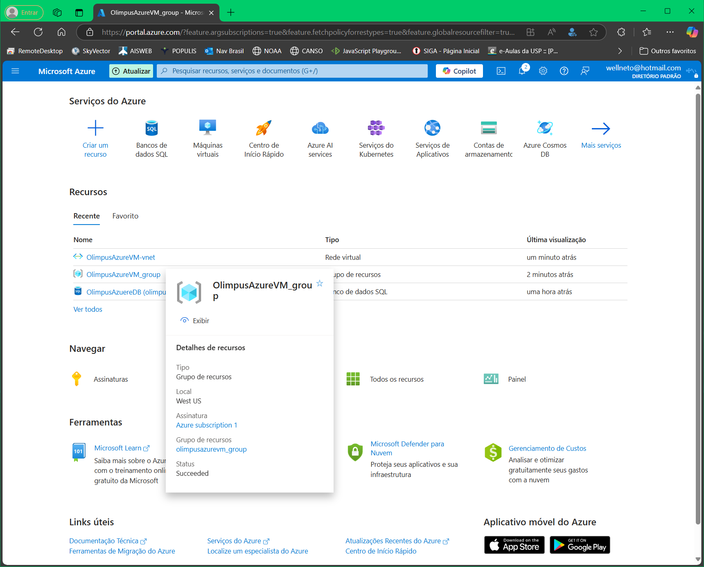
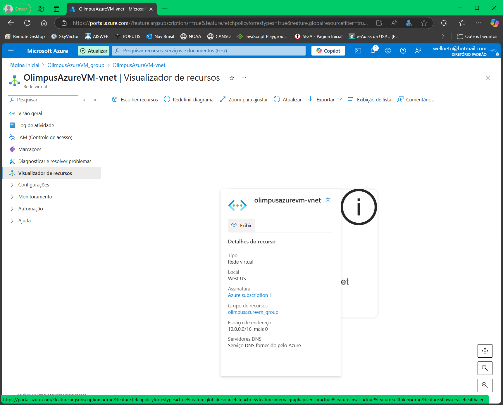

# DIO - Trilha Java Básico

## Autor

🔸[wprotheus](https://github.com/wprotheus)

---

## Desafio - Construindo Arquiteturas no Azure

Atividade executada conforme orientações abaixo, retiradas do [Descrição do Desafio](https://web.dio.me/lab/componentes-de-arquitetura-do-azure-laboratorio/learning/e9c60338-3fe5-4ad0-a1db-a85daee9c462)  
<small>Obs.: O link acima somente é acessado através de uma conta na plataforma DIO.</small>

### Descrição do Desafio

> Este laboratório tem como objetivo **explorar a plataforma Microsoft Azure.**
  
### Orientações para a entrega:

>1. **Assista o curso “Como Entregar o Seu Desafio de Projeto”**, para que você possa entender a essência de um Desafio de Projeto, bem como o passo a passo para concluí-lo aqui na plataforma da DIO.

>2. Lembre-se de **disponibilizá-lo em um repositório público no GitHub**. Como orientação, elabore um README com uma breve descrição do passo a passo conforme a executou, bem como links úteis para o seu projeto.

>3. Lembre-se de que assumir o protagonismo e de criar um **<u>portfólio durante essa jornada</u>**. Isso fará toda diferença em seu desenvolvimento pessoal e profissional.

---   

# 🌐 Criando um Grupo de Recursos com VPN na Azure

## 🎯 Objetivo

Criar um **Grupo de Recursos**, uma **Rede Virtual (VNet)** e uma **VPN Gateway** na **Microsoft Azure**.

---

## ✅ Pré-requisitos

- Conta ativa na Azure
- Permissões para criar recursos de rede e VPN Gateway

---

## 📘 Passo a Passo

### 1. Criar Grupo de Recursos

1. Acesse o [Portal Azure](https://portal.azure.com)
2. Pesquise por "**Grupos de recursos**" e clique em "**+ Criar**"
3. Preencha:
    - **Nome:** `grupo-vpn-demo`
    - **Região:** Escolha a mais próxima de você
4. Clique em **Revisar + Criar** → **Criar**

---

### 2. Criar uma Rede Virtual (VNet)

1. Pesquise por "**Rede Virtual**" > "**+ Criar**"
2. Selecione:
    - **Grupo de recursos:** `grupo-vpn-demo`
    - **Nome da VNet:** `vnet-vpn-demo`
    - **Região:** mesma do grupo de recursos
3. Configure:
    - **Intervalo de endereços IP:** `10.0.0.0/16`
    - **Sub-rede:**
        - Nome: `GatewaySubnet` ⚠️
        - Intervalo: `10.0.0.0/24`
4. Clique em **Revisar + Criar** → **Criar**

---

### 3. Criar IP Público para o Gateway

1. Pesquise por "**Endereço IP público**" > "**+ Criar**"
2. Configure:
    - **Nome:** `ip-vpn-gateway`
    - **SKU:** `Basic` ou `Standard`
    - **Atribuição:** `Estático`
    - **Região:** mesma da VNet
    - **Grupo de Recursos:** `grupo-vpn-demo`
3. Clique em **Revisar + Criar** → **Criar**

---

### 4. Criar a VPN Gateway

1. Pesquise por "**Gateway de rede virtual**" > "**+ Criar**"
2. Preencha:
    - **Nome:** `vpn-gateway-demo`
    - **Região:** mesma da VNet
    - **Gateway type:** `VPN`
    - **VPN type:** `Route-based`
    - **SKU:** `VpnGw1`
    - **Rede virtual:** `vnet-vpn-demo`
    - **GatewaySubnet:** será selecionada automaticamente
    - **Endereço IP público:** `ip-vpn-gateway`
3. Clique em **Revisar + Criar** → **Criar**

> ⏳ A criação da VPN Gateway pode levar de 20 a 45 minutos.

---

## 🛠️ Próximos Passos (Opcional)

- Criar conexões site-to-site ou point-to-site
- Gerar certificados (para conexões remotas)
- Monitorar com Azure Network Watcher

---

## 📷 Capturas de telas

### Tela inicial da criação grupo/recurso:
  

### Tela final da criação grupo/recurso:
  

---  

> **Nota:** Este guia aborda configurações básicas. Para recursos avançados e personalizações, consulte a [documentação oficial da Microsoft](https://learn.microsoft.com/pt-br/azure/virtual-network/).
